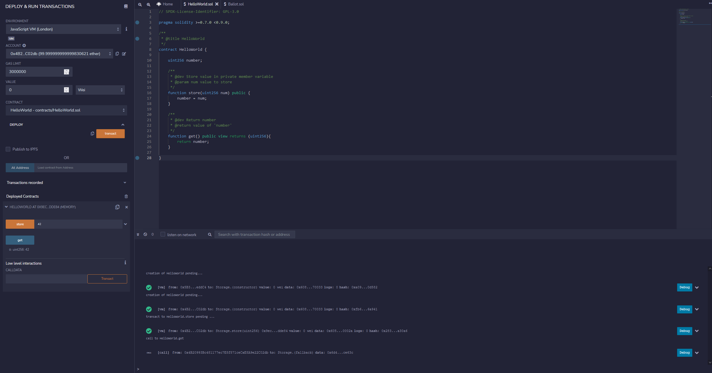
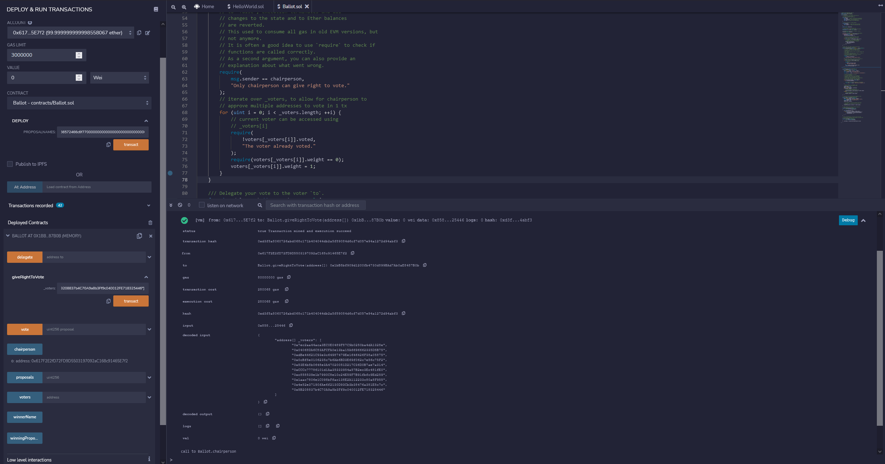

<h1>
ZKU Background
</h1>

# HelloWorld
`HelloWorld.sol` contains the code for storing and fetching an unsigned integer.

`Ballot.sol` contains the code for allowing multiple voters to be added in 1 transaction.

## Gas Costs
| Signature | Gas | Notes |
| :-------: | :-: | :---: |
| giveRightToVote(address) | 48657 |  |
| giveRightToVote(address[] memory) | 280068 | Called with 10 voters |

On average, adding one voter costs `280068 / 10 = 28007` using an array of addresses, vs. `48657` gas to add one voter on the old contract. 

Whilst loops can be inefficient in Solidity, they can be more efficient than creating multiple calls to achieve the same goal due to the [base cost](https://ethereum-magicians.org/t/some-medium-term-dust-cleanup-ideas/6287#why-do-txs-cost-21000-gas-1) of a tx.

# Execution
### `HelloWorld.sol`

### `Ballot.sol`
